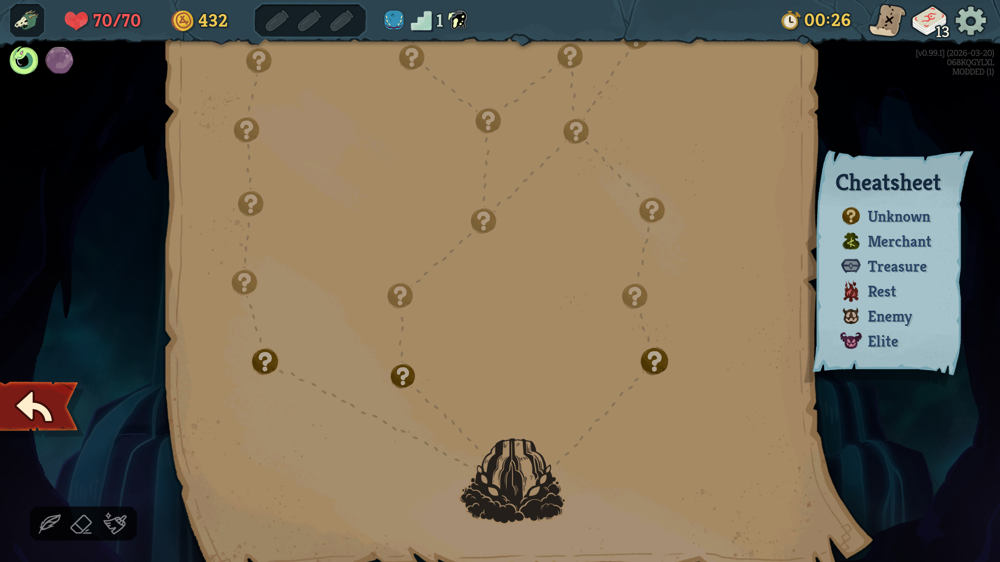

# MysterySpire

A Slay the Spire 2 mod that hides map room icons — all rooms show the unknown `?` icon until you visit them. The legend is also renamed to "Cheatsheet" as a reminder that you're playing without it.

Visual only. Does not affect gameplay or room generation.

## Installation

1. Download `MysterySpire.dll` and `mod_manifest.json` from [Releases](../../releases)
2. Place both files into a `MysterySpire/` folder inside your STS2 mods directory:
   ```
   Steam/steamapps/common/Slay the Spire 2/mods/MysterySpire/
   ├── MysterySpire.dll
   └── mod_manifest.json
   ```
3. Launch the game — it will detect the mod automatically

**Linux only:** Add this to your Steam launch options (right-click STS2 → Properties → General):
```
LD_PRELOAD=/usr/lib/libgcc_s.so.1 %command%
```

## Uninstalling/disabling
At this point in Early Access, when you run the game with mods it is a separate instance with it's own progression, unlocks and saved games. Mods can be enabled and disabled in the Settings, under the Mod Settings submenu. You'll need to restart your client for changes to take effect.

You can uninstall the mod by deleting the files or removing them from the `mods` folder.
